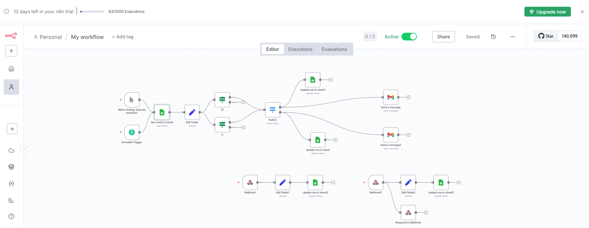
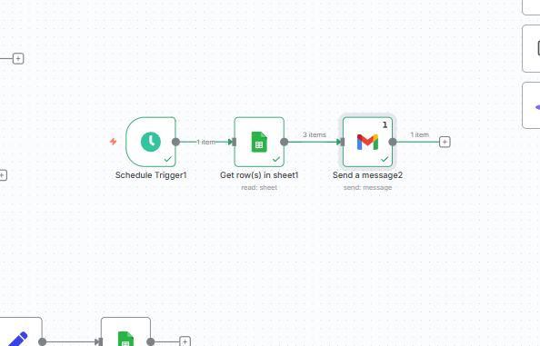
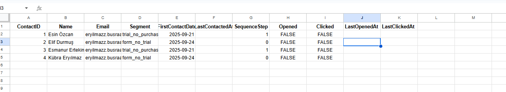
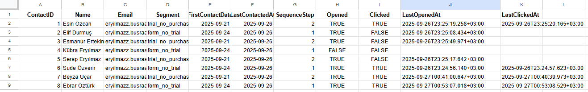
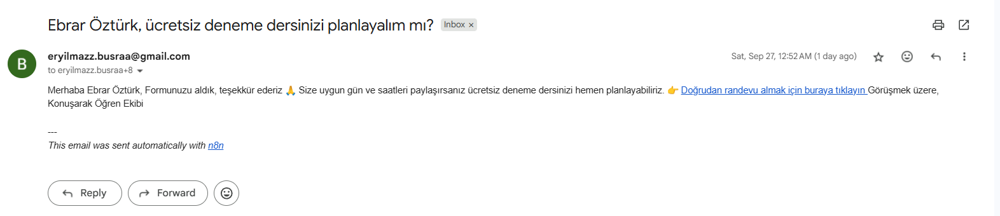
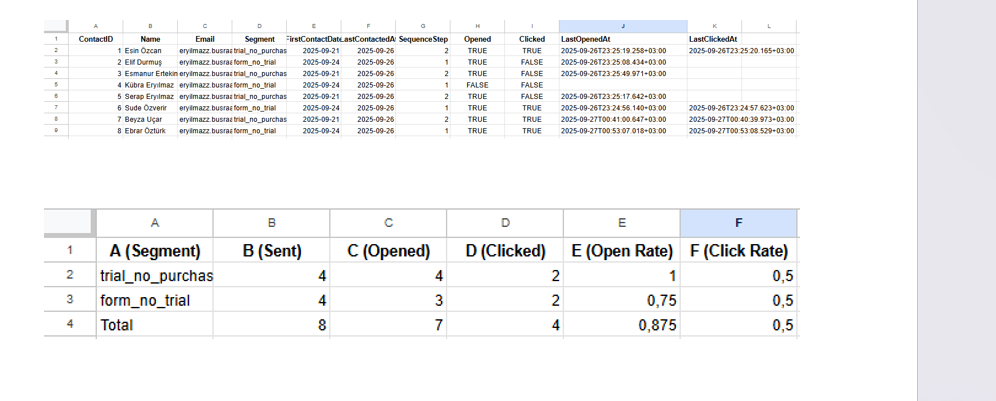
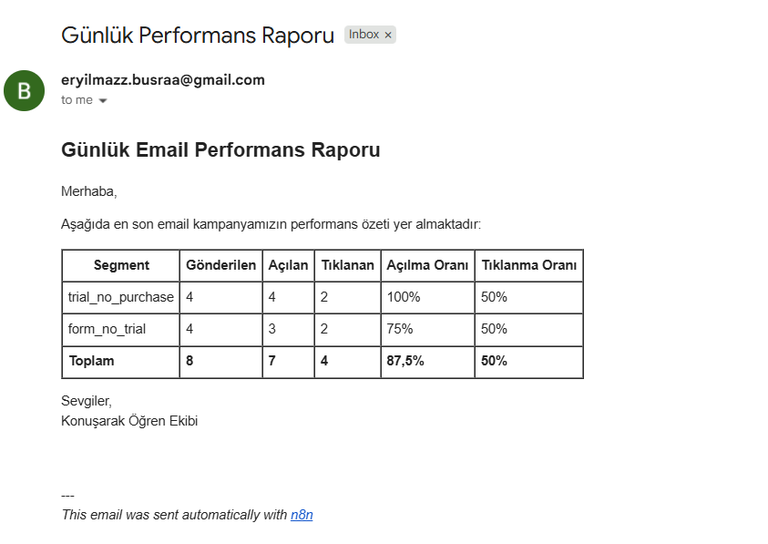

# n8n Email Automation Workflow

This project implements a **professional email automation system** built with [n8n](https://n8n.io/).  
The workflow automates lead nurturing through **segment-based targeting** and **time-based email sequences**, while also providing **daily performance reporting to managers**.  

---

# Overview

# Workflow Overview
  
# Workflow Overview - System for sending daily reports to managers
  
# Dataset Overview
  
  
# Sample Email
  
# Performance Table

# Sample Email for Managers
  

The system integrates with **Google Sheets** for lead data and **Gmail** for outbound communication.  
It ensures that each lead receives the right email at the right time and that managers are kept informed with automatic daily reports.  

---

# System Architecture

## 1. Segment-Based Targeting
- **Trial users without purchase** → Discount offer sequence  
- **Form submissions without trial** → Trial scheduling sequence  

## 2. Time-Based Sequences
- **Day 2**: First follow-up email  
- **Day 5**: Second follow-up email  

## 3. Tracking & Logging
- **Open Tracking**: Invisible pixel with webhook update  
- **Click Tracking**: Redirect mechanism with event logging in Google Sheets  

## 4. Performance Reporting
- A summary report is generated daily in **Google Sheets**  
- **n8n** automatically sends this performance report by email to managers at a fixed time each day  
- Report includes key metrics such as number of emails sent, opens, and clicks  

---

# Technology Stack

- **n8n** – Workflow automation  
- **Google Sheets** – Lead data & reporting  
- **Gmail** – Email delivery  

---

# Key Outcomes

- Automated, segment-based email follow-ups  
- Consistent time-based communication with leads  
- Real-time tracking of engagement (opens & clicks)  
- Daily performance reports delivered directly to managers  
- Significant reduction in manual workload and improved visibility  

---

# Usage

1. Clone this repository or download the workflow JSON file.  
2. Import the workflow into n8n (`Import from File`).  
3. Connect Google Sheets and Gmail accounts.  
4. Prepare your Google Sheet using the following structure:  

   | Name        | Email              | Segment           | FirstContactDate | SequenceStep | LastContactedAt | Opened | Clicked |
   |-------------|--------------------|-------------------|------------------|--------------|-----------------|--------|---------|
   | John Doe    | john@example.com   | trial_no_purchase | 2025-09-20       | 0            | -----------------| FALSE | FALSE   |
   | Jane Smith  | jane@example.com   | form_no_trial     | 2025-09-18       | 1            |----------------- | FALSE | FALSE   |

   **Column Logic**  
   - **Segment** → defines the customer type (e.g., `trial_no_purchase`, `form_no_trial`).  
   - **FirstContactDate** → date when the lead first interacted.  
   - **SequenceStep** → updated by n8n after each email is sent (0 = none, 1 = first email sent, 2 = second email sent).  
   - **LastContactedAt** → last date when the system sent an email.  
   - **Opened / Clicked** → boolean flags automatically updated by n8n via webhook when the user opens or clicks.  

   **Workflow Conditions**  
   - If **(Today – FirstContactDate) = 2** AND **SequenceStep = 0** → send first follow-up email.  
   - If **(Today – FirstContactDate) = 5** AND **SequenceStep = 1** → send second follow-up email.  
   - After each email → update **SequenceStep** and **LastContactedAt** in Google Sheets.  

5. Activate the Schedule Trigger to enable daily execution.  

---

# Author

Prepared by **Büşra Eryılmaz**  
Date: September 26, 2025  
